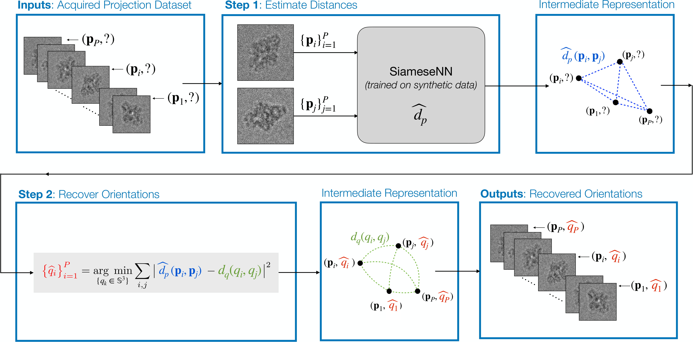

# Learning to recover orientations from projections in single-particle cryo-EM

[Jelena Banjac](https://jelenabanjac.com), Data Science master student,
[Laurène Donati](https://people.epfl.ch/laurene.donati), BIG,
[Michaël Defferrard](https://deff.ch/), LTS2, EPFL.

* Paper: [`arXiv:2104.06237`](https://arxiv.org/abs/2104.06237)
* Website with interactive visualizations: <https://jelenabanjac.com/protein-reconstruction/index.html>

> A major challenge in single-particle cryo-electron microscopy (cryo-EM) is that the orientations adopted by the 3D particles prior to imaging are unknown; yet, this knowledge is essential for high-resolution reconstruction.
> We present a method to recover these orientations directly from the acquired set of 2D projections.
> Our approach consists of two steps: (i) the estimation of distances between pairs of projections, and (ii) the recovery of the orientation of each projection from these distances.
> In step (i), pairwise distances are estimated by a Siamese neural network trained on synthetic cryo-EM projections from resolved bio-structures.
> In step (ii), orientations are recovered by minimizing the difference between the distances estimated from the projections and the distances induced by the recovered orientations.
> We evaluated the method on synthetic cryo-EM datasets.
> Current results demonstrate that orientations can be accurately recovered from projections that are shifted and corrupted with a high level of noise.
> The accuracy of the recovery depends on the accuracy of the distance estimator.
> While not yet deployed in a real experimental setup, the proposed method offers a novel learning-based take on orientation recovery in SPA.



## Repository content

[Notebooks](./notebooks), used to reproduce our findings, are divided in the following phases:

0. [Data preparation](https://jelenabanjac.com/protein-reconstruction/phase0_intro.html): generate 2D projections from a protein
1. [Distance estimation](https://jelenabanjac.com/protein-reconstruction/phase1_intro.html): learn a function to estimate the distance between two projections
2. [Orientation recovery](https://jelenabanjac.com/protein-reconstruction/phase2_intro.html): recover the projections' orientations from estimated distances
3. [Protein reconstruction](https://jelenabanjac.com/protein-reconstruction/phase3_intro.html): reconstruct the protein from its projections and their recovered orientations
4. [Miscellaneous notebooks](https://github.com/JelenaBanjac/protein-reconstruction/tree/master/notebooks/misc-notebooks): non-clean notebooks during developing process, use at your own risk.

The notebooks in each folder represent different experimental conditions or modeling approach.

Additionally, the [`cryoem`](./cryoem) python package contains scripts to generate a huge amount of 2D projections with corresponding orientation.

## Installation

Install the software dependencies:
```bash
# clone the repository
git clone https://github.com/JelenaBanjac/protein-reconstruction.git
cd protein-reconstruction

# create and activate the environment
conda env create -f environment.yml
conda activate protein_reconstruction
```

Run the jupyter notebooks (`$1` is GPU id, `$2` is the port where jupyter is served if ran externally):
```bash
cd notebooks
export CUDA_VISIBLE_DEVICES=$1
nohup jupyter notebook --ip=0.0.0.0 --port=$2 &
```

## Licence & citation

The code in this repository is released under the terms of the [MIT license](LICENSE).
Please cite our paper if you use it.

```
@inproceedings{cryoem_orientation_recovery,
  title = {Learning to recover orientations from projections in single-particle cryo-EM},
  author = {Banjac, Jelena, Donati, Laur\`ene, and Defferrard, Micha\"el},
  year = {2021},
  archivePrefix={arXiv},
  eprint={2104.06237},
  url = {https://arxiv.org/abs/2104.06237},
}
```

