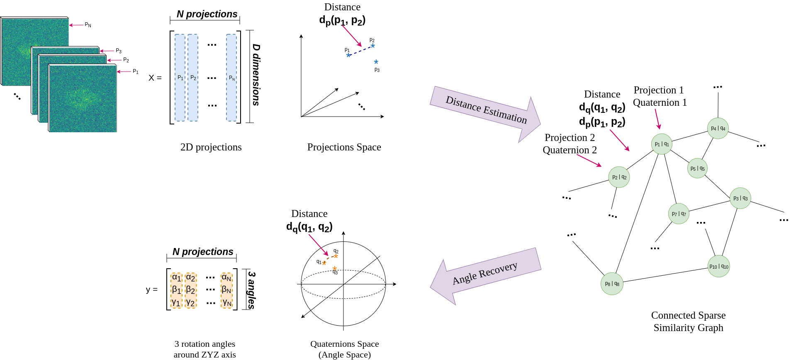

# 3D Poses Recovery in Single-Particle Cryo-EM from Learned Pairwise Projection Distances

The topic of this project is to learn pairwise projection distances in order to recover the angles at which we imaged these 2D projections from a given 3D protein.

## Summary
Single-particle cryo-electron microscopy (cryo-EM) is a technology that allows the observation and the high-resolution 3D structure determination of biomolecules. In this project, the goal is to estimate the angles at which we imaged the 2D projections from a given 3D protein (cf illustration bellow). We developed deep learning models to estimate the angles from learned pairwise projection distances. We designed a two-step method: 1) **distance estimation** using a Siamese neural network to learn the distance between pairs of projections, and 2) **angle recovery** that includes a minimization scheme in order to estimate the angles at which each projection was taken. The current results obtained are discussed depending on different combination of approaches used andexperimental conditions.


## General Flow
General flow of the project can be seen in the illustration bellow:


## Report
More details on the implementation can be found in the [report](reports/Report_BIGSemesterProject_JelenaBanjac.pdf).  
The presentation slideshow can be found on this [link](https://docs.google.com/presentation/d/e/2PACX-1vSeN_Zd4mL9ScdvlEAIib4QFq3kkUxojnj-YBEAGuxKxPDQ48PCL2Y_JBT4cn_UBcIFhPp_YnNZZF1c/pub?start=true&loop=false&delayms=3000) and the presentation material on this [link](reports/Presentation_BIGSemesterProject_JelenaBanjac.pdf).

## Repository
This repository contains scripts to generate a huge amount of 2D projections with corresponding angles of 3D volumes. 
Also, it contains the notebooks with different combinations of project approaches.

## Installation
Create the conda environment in which the project will be ran.
```
# create environment
$ conda env create -f environment.yml

# activate environment
$ conda activate protein_reconstruction
```

[Optional] Test if some dependencies are installed:
```
# tensorflow check
$ python3 -c "import tensorflow as tf; print(tf.reduce_sum(tf.random.normal([1000, 1000])))"

# astra toolbox check
$ python3 -c "import astra;astra.test_CUDA()"
```

## Run

```
usage: generator.py [-h] --config-file CONFIG_FILE [--input-file INPUT_FILE]
                    [--projections-num PROJECTIONS_NUM]
                    [--angle-shift ANGLE_SHIFT]
                    [--angle-coverage ANGLE_COVERAGE]
                    [--output-file OUTPUT_FILE]

Generator of 2D projections of 3D Cryo-Em volumes Args that start with '--'
(eg. --input-file) can also be set in a config file (protein.config or
specified via --config-file). Config file syntax allows: key=value, flag=true,
stuff=[a,b,c] (for details, see syntax at https://goo.gl/R74nmi). If an arg is
specified in more than one place, then commandline values override config file
values which override defaults.

optional arguments:
  -h, --help            show this help message and exit
  --config-file CONFIG_FILE, -conf CONFIG_FILE
                        Config file path
  --input-file INPUT_FILE, -in INPUT_FILE
                        Input file of 3D volume (*.mrc format)
  --projections-num PROJECTIONS_NUM, -num PROJECTIONS_NUM
                        Number of 2D projections. Default 5000
  --angle-shift ANGLE_SHIFT, -shift ANGLE_SHIFT
                        Get the start Euler angles that will rotate around
                        axes Z, Y, Z repsectively
  --angle-coverage ANGLE_COVERAGE, -cov ANGLE_COVERAGE
                        The range (size of the interval) of the Euler angles
                        aroung Z, Y, Z axes respectively
  --output-file OUTPUT_FILE, -out OUTPUT_FILE
                        Name of output file containing projections with angles
                        (with the extension)

```

Main use is:
```
# read the settings from config file
python generator.py -config protein.config

# almost half sphere (overrides config default values)
python generator.py -conf protein.config --input-file data/5j0n.mrc -num 5000 -shift 0.0 -shift 0.0 -shift 0.0 -cov 2.0 -cov 0.4 -cov 2.0
```

## Misc information

### Package versions
The following versions of the packages are installed with Astra-toolbox installation.
```
python-3.6.8
cudnn-7.1.3
cudatoolkit-8.0
```
```
cuda 10
cuDNN 7
nvidia driver 415

```

```
$ nvcc --version

$ cat /usr/local/cuda/include/cudnn.h | grep CUDNN_MAJOR -A 2
```

# Notebooks

Data generation:
- [5j0n_generate_data_5000_0.5sphere.ipynb](notebooks/5j0n_generate_data_5000_0.5sphere.ipynb)
- [GeneratingData.ipynb](notebooks/GeneratingData.ipynb)
- [Graph-50000HalfAngCoverage.ipynb](notebooks/Graph-50000HalfAngCoverage.ipynb)
- [Graph-5000FullAngCoverage.ipynb](notebooks/Graph-5000FullAngCoverage.ipynb)
- [Graph-5000HalfAngCoverage.ipynb](notebooks/Graph-5000HalfAngCoverage.ipynb)
- [Graph-5000HalfAngCoverage-WithGaussNoise15.ipynb](notebooks/Graph-5000HalfAngCoverage-WithGaussNoise15.ipynb)
- [Graph-5000HalfAngCoverage-WithGaussNoise2.ipynb](notebooks/Graph-5000HalfAngCoverage-WithGaussNoise2.ipynb)

Different angle coverage visualizations:
- [angle_variety.ipynb](notebooks/angle_variety.ipynb)

Euclidean distance estimation and angle recovery on BGAL protein (symmetric):
- [bgal_optimization_predicted_angle_and_true_angle.ipynb](notebooks/bgal_optimization_predicted_angle_and_true_angle.ipynb)
- [bgal_optimization_predicted_angle_and_true_projection_(knn_and_slope).ipynb](notebooks/bgal_optimization_predicted_angle_and_true_projection_(knn_and_slope).ipynb)
- [bgal_optimization_predicted_angle_and_true_projection_(knn_and_slope)-LR0.001.ipynb](notebooks/bgal_optimization_predicted_angle_and_true_projection_(knn_and_slope)-LR0.001.ipynb)
- [bgal_optimization_predicted_angle_and_true_projection_(knn&random_and_slope)-Copy1.ipynb](notebooks/bgal_optimization_predicted_angle_and_true_projection_(knn&random_and_slope)-Copy1.ipynb)
- [bgal_optimization_predicted_angle_and_true_projection_(knn&random_and_slope).ipynb](notebooks/bgal_optimization_predicted_angle_and_true_projection_(knn&random_and_slope).ipynb)
- [bgal_optimization_predicted_angle_and_true_projection_(random_and_polyfit)-CONSTRAINED-TODO.ipynb](notebooks/bgal_optimization_predicted_angle_and_true_projection_(random_and_polyfit)-CONSTRAINED-TODO.ipynb)
- [bgal_optimization_predicted_angle_and_true_projection_(random_and_polyfit).ipynb](notebooks/bgal_optimization_predicted_angle_and_true_projection_(random_and_polyfit).ipynb)
- [bgal_optimization_predicted_angle_and_true_projection_(random_and_slope).ipynb](notebooks/bgal_optimization_predicted_angle_and_true_projection_(random_and_slope).ipynb)
- [optimization_predicted_angle_and_true_projection.ipynb](notebooks/optimization_predicted_angle_and_true_projection.ipynb)

Euclidean distance estimation and angle recovery on 5J0N protein (asymmetric):
- [5j0n_optimization_predicted_angle_and_true_projection_0.5angcov-corrected-%.ipynb](notebooks/5j0n_optimization_predicted_angle_and_true_projection_0.5angcov-corrected-%.ipynb)
- [5j0n_optimization_predicted_angle_and_true_projection_0.5angcov-corrected.ipynb](notebooks/5j0n_optimization_predicted_angle_and_true_projection_0.5angcov-corrected.ipynb)
- [5j0n_optimization_predicted_angle_and_true_projection_0.5angcov.ipynb](notebooks/5j0n_optimization_predicted_angle_and_true_projection_0.5angcov.ipynb)
- [5j0n_optimization_predicted_angle_and_true_projection_0.5angcov-RANDOM-corrected-%.ipynb](notebooks/5j0n_optimization_predicted_angle_and_true_projection_0.5angcov-RANDOM-corrected-%.ipynb)
- [5j0n_optimization_predicted_angle_and_true_projection_0.5angcov-RANDOM-corrected.ipynb](notebooks/5j0n_optimization_predicted_angle_and_true_projection_0.5angcov-RANDOM-corrected.ipynb)
- [5j0n_optimization_predicted_angle_and_true_projection_0.5angcov-RANDOM.ipynb](notebooks/5j0n_optimization_predicted_angle_and_true_projection_0.5angcov-RANDOM.ipynb)

Initial notebooks:
- [angle_optimization.ipynb](notebooks/angle_optimization.ipynb)
- [angle_optimization_with_GT-notworking.ipynb](notebooks/angle_optimization_with_GT-notworking.ipynb)

Manifold learning (on 5j0n):
- [MDS](notebooks/5j0n_manifold_learning_MDS.ipynb)
- [Spectral Embedding](notebooks/5j0n_manifold_learning_SpectralEmbedding.ipynb)

K-NN Adjacency matrices:
- [projections and angles](notebooks/knn_adjacency_matrices.ipynb)

Siamese NN (on 5j0n):
- [random sampling](notebooks/Siamese_KERAS-protein-random.ipynb)
- [knn projections and random sampling](notebooks/Siamese_KERAS-protein-knn-and-random.ipynb)
- toberemoved 1K epochs [knn projections and random sampling](notebooks/Siamese_KERAS-protein-epochs1000.ipynb)

## Team
**Student:**  
[Jelena Banjac](https://jelenabanjac.com), jelena.banjac@epfl.ch, Data Science Master Student

**Supervisors:**  
[Laurène Donati](https://people.epfl.ch/laurene.donati?lang=en), laurene.donati@epfl.ch, BIG, EPFL  
[Michaël Defferrard](https://deff.ch/), michael.defferrard@epfl.ch, LTS2, EPFL

**Professor:**  
[Michaël Unser](http://bigwww.epfl.ch/unser/), michael.unser@epfl.ch, BIG, EPFL

